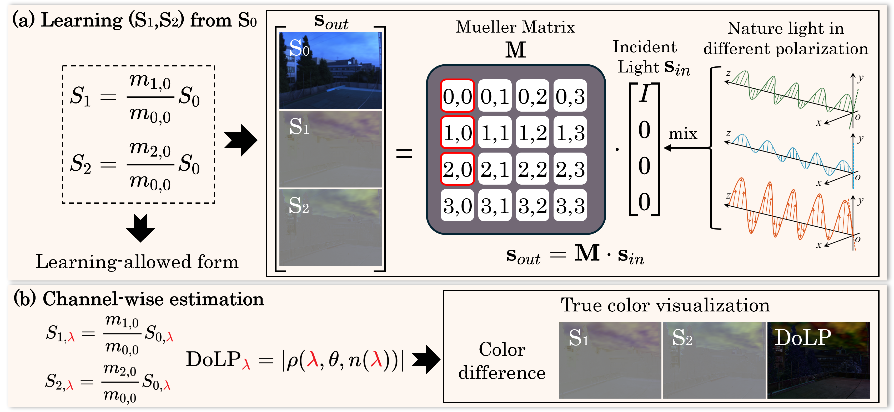
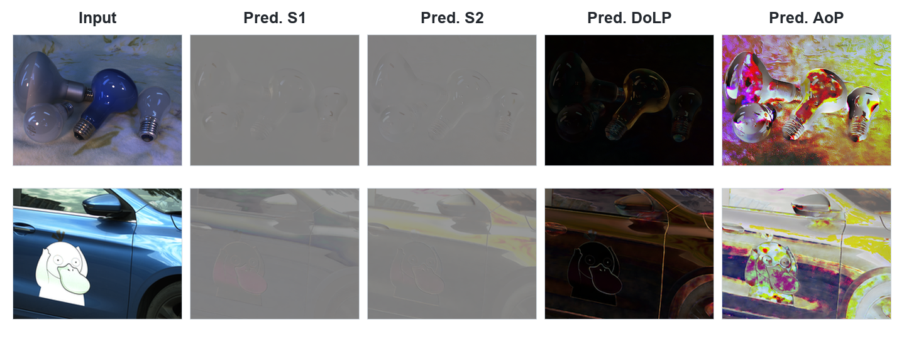

# GenPolar (ECCV 2026 Spotlight)

Official implementation of [**Stokes-Informed Diffusion for Robust Linear
Polarization Estimation**](https://arxiv.org/abs/2607.21239).

GenPolar estimates channel-wise linear Stokes components `(S1, S2)` from a
single RGB intensity proxy proportional to `S0`. DoLP and AoP are then derived
analytically. Training has two stages: a physics-supervised diffusion teacher,
followed by one-step distribution matching distillation (DMD) with rank-4 LoRA
adaptation of the VAE encoder.

## Motivation



Figure 2 summarizes our central viewpoint: Mueller transport makes
`S0 -> (S1, S2)` physically plausible, while the spectral dependence of
polarization motivates channel-wise RGB estimation.

## Released weights

The inference-ready checkpoints contain only the UNet and ControlNet state
dictionaries. Optimizers, epoch counters, auxiliary fake-score models, and
other training-only state have been removed.

| File | Purpose | Direct download |
|---|---|---|
| `genpolar_one_step.pth` | Recommended one-step inference model | [Download](https://huggingface.co/Roydon728/GenPolar/resolve/main/genpolar_one_step.pth) |
| `genpolar_stage1_teacher.pth` | Stage-I teacher used to initialize Stage II | [Download](https://huggingface.co/Roydon728/GenPolar/resolve/main/genpolar_stage1_teacher.pth) |
| `adapter_model.safetensors` | Rank-4 VAE-encoder LoRA from Stage II | [Download](https://huggingface.co/Roydon728/GenPolar/resolve/main/genpolar_vae_encoder_lora/adapter_model.safetensors) |
| `adapter_config.json` | LoRA configuration | [Download](https://huggingface.co/Roydon728/GenPolar/resolve/main/genpolar_vae_encoder_lora/adapter_config.json) |

The complete model card and file browser are at
[Roydon728/GenPolar](https://huggingface.co/Roydon728/GenPolar). The encoder
LoRA is a Stage-II training artifact; one-step release inference starts from
Gaussian noise and therefore does **not** use the VAE encoder or its LoRA.

## Installation

Python 3.10 or newer and a CUDA-capable GPU are recommended.

```bash
cd GenPolar
python -m venv .venv
source .venv/bin/activate
pip install -r requirements.txt
```

On Windows, activate the environment with `.venv\Scripts\activate`.

## Quick Test

The bundled `examples/monno_lamp.png` and `examples/cpif_bluecar.png` are RGB
intensity proxies computed by averaging the four analyzer-angle images from the
Monno `lamp` and CPIF `bluecar` scenes. The one-step checkpoint is downloaded
automatically from Hugging Face on first use. These example images remain
subject to their source datasets' terms.

```bash
python inference.py examples --output outputs --seed 42
```

### Example Results



The panel was generated with the released one-step model using seed 42. `S1`
and `S2` are shown as signed Stokes visualizations; DoLP and AoP are displayed
channel-wise in RGB.

Each image produces:

- `polarization.npz`: float32 `s0`, `s1`, `s2`, `dolp`, and `aop` arrays;
- `s1.png` and `s2.png`: signed Stokes visualizations;
- `dolp.png` and `aop.png`: channel-wise RGB visualizations.

## Data

Keep training and test sets under `Datasets/train/` and `Datasets/test/`.
The recommended layout is `split/dataset_name/data`; each training dataset
directory is configured as one `dataroot_gt`. Exact directory layouts, file
names, array shapes, and value ranges for the supported `.npy`, Stokes-image,
and four-angle formats are documented in
[`Datasets/README.md`](Datasets/README.md).

The public configuration follows the paper: `S1,S2` are in `[-1,1]`, physical
`S0` is in `[0,2]`, and the network condition is `S0 - 1` in `[-1,1]`.

## Training

Stage I trains the 8-channel UNet and ControlNet for clean-latent prediction
while keeping the text encoder and VAE frozen:

```bash
accelerate launch train_stg1.py \
  --data-config data_config.yaml \
  --batch-size 1 --learning-rate 4e-5
```

Stage II downloads the public Stage-I teacher unless `--teacher` is supplied.
It jointly trains the one-step generator and VAE-encoder LoRA while the
teacher, ControlNet, and VAE decoder stay frozen:

```bash
accelerate launch train_dmd_distill.py \
  --data-config data_config.yaml \
  --batch-size 1 --learning-rate 1e-5
```

Resume Stage II with:

```bash
accelerate launch train_dmd_distill.py \
  --teacher /path/to/stage1/checkpoint_latest.pth \
  --resume checkpoints/stage2/checkpoint_latest.pth
```

For a fully paper-normalized run, first train Stage I with the public
`data_config.yaml`, then pass its `checkpoint_latest.pth` to Stage II through
`--teacher`.

The implementation follows the paper as follows:

| Paper | Implementation |
|---|---|
| Eq. (6)-(7) | separate S1/S2 VAE encoding, concatenated 8-channel latent, direct clean-latent MSE |
| Eq. (8)-(10) | global Stokes L1 plus GT-DoLP-masked, pi-periodic AoP loss |
| Eq. (11) | LoRA-encoded target noised at the fixed maximum timestep |
| Eq. (12)-(13) | frozen real score versus online fake score DMD gradient |
| Eq. (14)-(15) | posterior KL and end-to-end physics gradients routed to encoder LoRA |
| Inference | Gaussian 8-channel latent, one generator call, fixed VAE decoding |


## Citation

```bibtex
@article{luo2026genpolar,
  title     = {Stokes-Informed Diffusion for Robust Linear Polarization Estimation},
  author    = {Luo, Yidong and Li, Chenggong and Feng, Yuchao and Shi, Boxin and Zhang, Junchao and Yuan, Xin},
  booktitle = {European Conference on Computer Vision (ECCV)},
  series    = {Lecture Notes in Computer Science},
  volume    = {17013},
  pages     = {512--529},
  publisher = {Springer},
  year      = {2026},
  doi       = {10.1007/978-3-032-37271-0_28}
}
```

## License

The source code is released under the [MIT License](LICENSE). Model weights and
third-party dependencies remain subject to their respective licenses.
